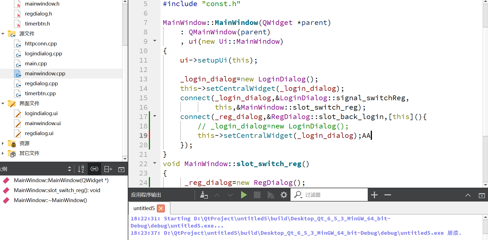

<!-- TOC -->autoauto- [1.setCentralWidget](#1setcentralwidget)auto- [2.项目中出现的bug](#2项目中出现的bug)autoauto<!-- /TOC -->
# 1.setCentralWidget
setcentralwidget用于给QMainWindow类设置中心部件，设置完毕会自动显示该中心部件。但是其中有需要我们注意的点
```cpp
//假设有一个QMainWindow对象指针m
QDialog *dig=new QDidlog();
m->setCentralWidget(dia);

QPushButton *btn=new QPushButton();
btn->setCentralWiget(btn);
//注意此时dig对象会被自动销毁，如果需要切换回dia对象，需要重新为dig分配内存，不然就会出现崩溃
```
# 2.项目中出现的bug
今天在qt项目中出现了一个bug，想实现在mainwindow中设置一个新的dialog中心部件，然后再切换回原来的dialog中心部件，结果程序崩溃，控制台不输出任何别的信息，让人很难排错
如下图


最后几经波折终于找到问题所在：
是setCentralWidget时会自动将原来的中心部件销毁，无论之前的中心部件是动态申请内存的，都会销毁，所以想要返回原来的部件就必须重新申请内存空间