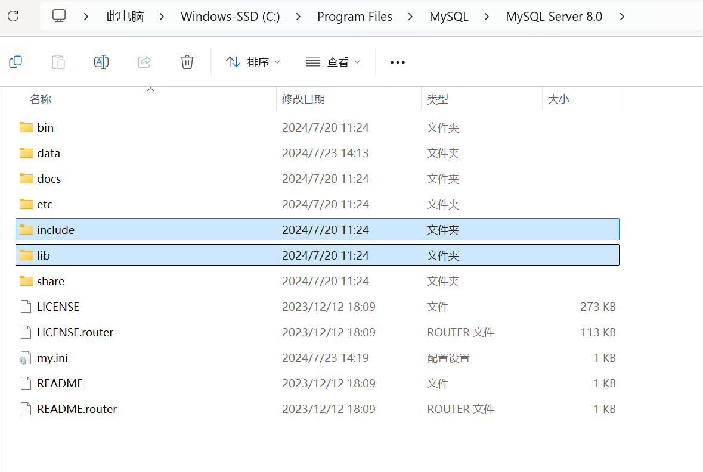
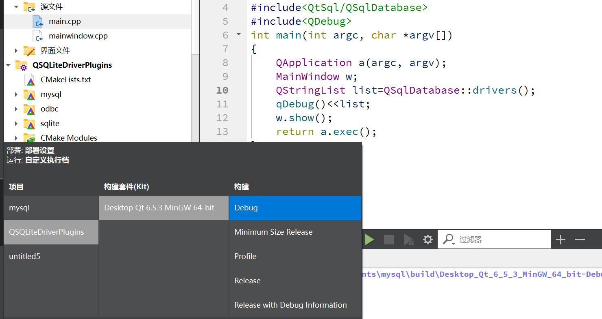
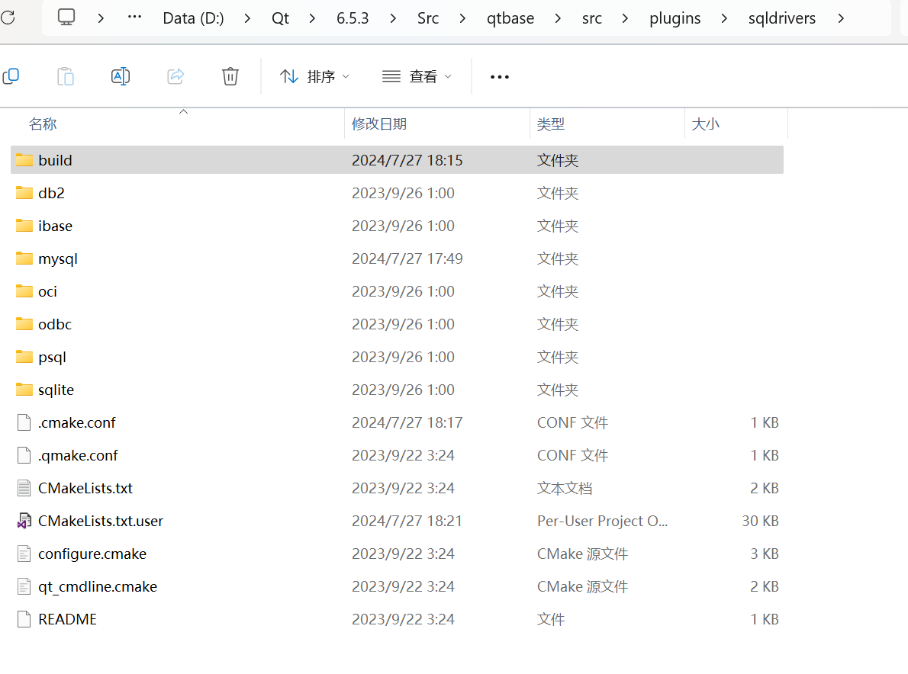

# 1.
首先将我们的mysql中的include和lib文件夹拷贝到一个方便的目录，我这里是拷贝到**D:/cppsoft/mysql**中了，也可以直接使用原本的文件路径，拷贝只是为了方便。

要使用的文件

拷贝到

# 2.
进入**D:\Qt\6.5.3\Src\qtbase\src\plugins\sqldrivers**目录然后编辑.cmake.conf文件

加上这三句话，因为要使用我们安装的mysql服务中的include和lib文件夹
>SET(FEATURE_sql_mysql ON)
//表示要引用的包含目录
SET(MySQL_INCLUDE_DIR "D:/cppsoft/mysql/include")
//表示要链接的库
SET(MySQL_LIBRARY "D:/cppsoft/mysql/lib/libmysql.lib")

# 3.
然后在qtcreator中打开CMakeLists.txt

# 4.
选择我们需要使用的套件，然后点击构建debug版本或者release版（按自己需要构建）

# 5.
最终将生成的**qsqlmysql.dll**和**qsqlmysqldebug**(在bulid目录下的debug的lib目录里面)

放到我们编译套件mingw_64的目录下**D:\Qt\6.5.3\mingw_64\plugins\sqldrivers**

# 6.
在qt中编译我们的代码

可以看到已经有了**QMYSQL**此时就可以通过qt中的相关类访问数据库了